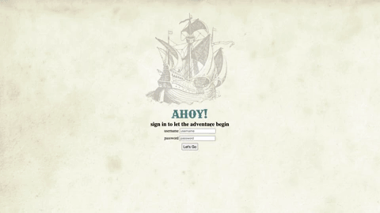
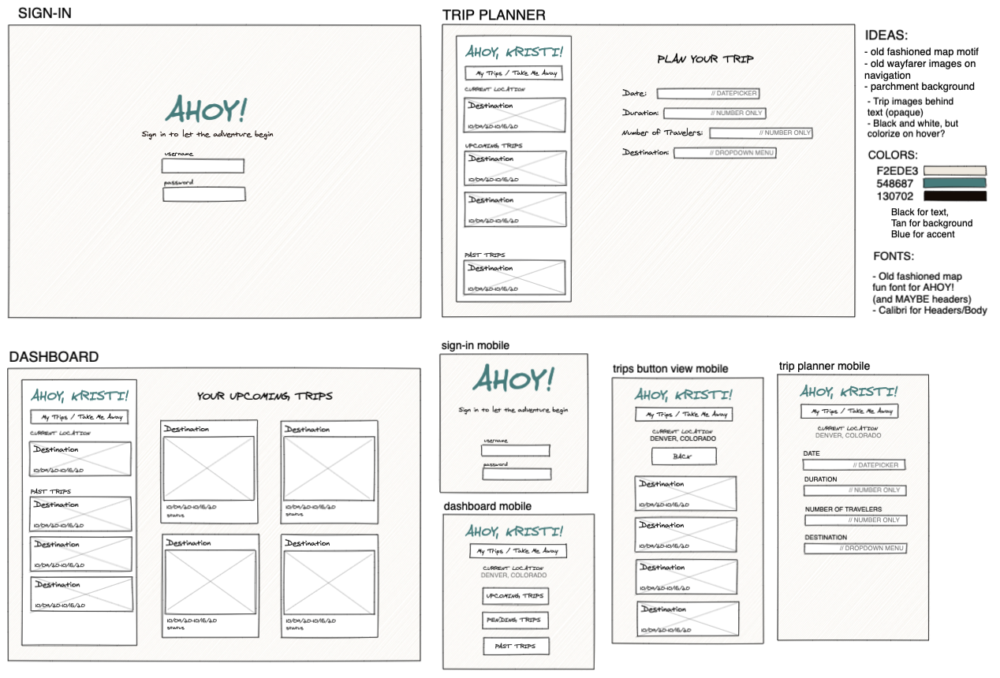
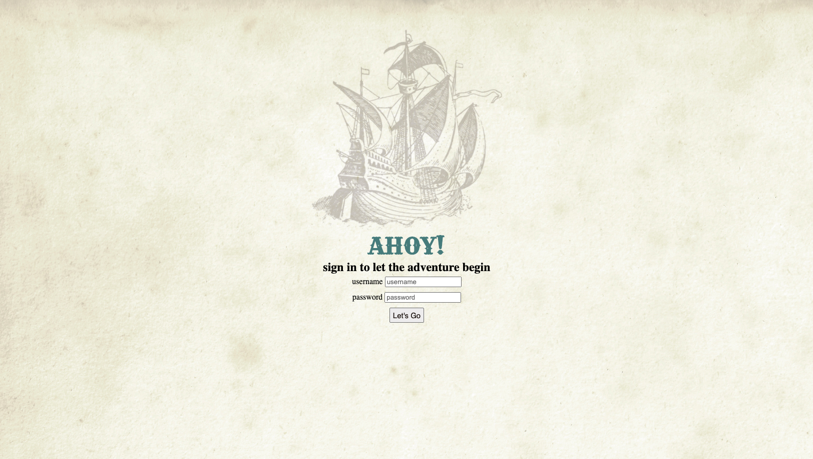
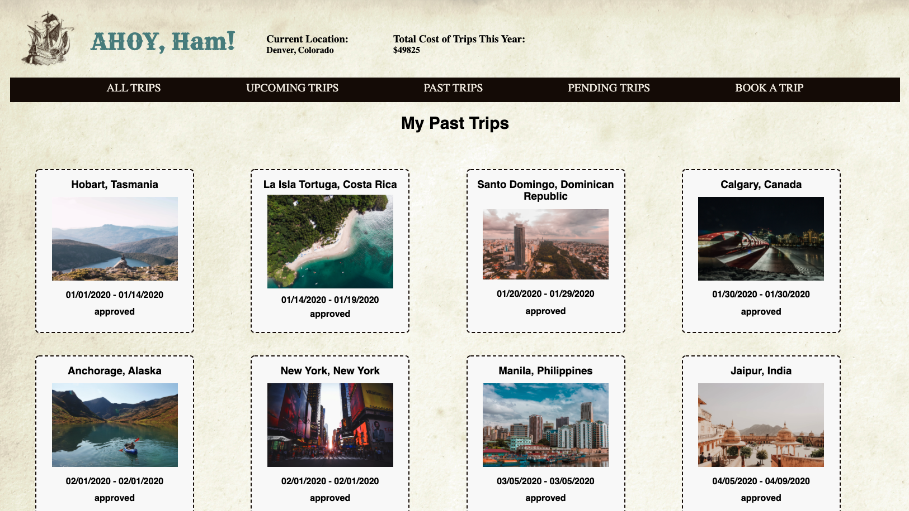
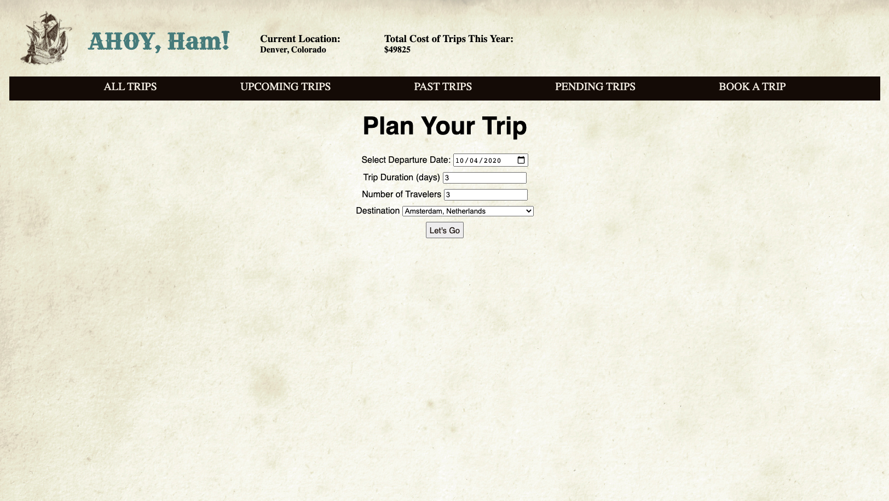

 

  

  <h3 align="center">AHOY!</h3>

  

    A Turing School Mod 2 Final Project (Travel-Tracker)
     
    <a href="https://github.com/Kristiannmiller/km-Travel-Tracker"><strong>Repo Link</strong></a>
     
     
  

## About The Project

This project is part of Turing Software and Designs' Front-End Program, Module 2. The project focuses on creating an application to manage and track different trips for users and a travel agency. The program is implemented with ES6 syntax and exclusively uses array-prototype methods whenever iterations need to be performed. There are no for loops used in the program. A Webpack starter-kit was provided, but all code and tests are written by the assigned developer. This program uses Object Oriented Programming to drive the design of the application and the code. This program focuses on working with an API to send and receive data (via fetch functions), the use of Sass alongside traditional css, and Mocha and Chai for testing class functions.

### Built With

* Node.js
* Mocha
* Chai
* Webpack

### Installation
In your terminal:
1. Clone the repo-
`git clone git@github.com:Kristiannmiller/km-Travel-Tracker.git`

2. Install NPM packages- `npm install`

3. Run webpack - `npm start`

4. Visit `http://localhost:8080/` in your browser

## Where it began

## Usage
#### LOG-IN VIEW

#### DASHBOARD VIEW

#### TRIP-PLANNER VIEW

## Roadmap

The total time allotted for this project was approximately 8 days. Future features contemplated by the developer include the following:

* Add a feature where users can leave comments on certain trips, or upload their own photos
* Add agency side
* Be able to delete/edit a trip

See the [open issues](https://github.com/Kristiannmiller/km-Travel-Tracker/issues) for a list of proposed features (and known issues).

## Contact

[Kristi Miller - Developer](https://github.com/Kristiannmiller)

[Nicole Gooden - Student Advisor](https://github.com/nicolegooden)

[Robert Gu - Project Manager](https://github.com/BobGu)

Project Link: [AHOY! / Travel-Tracker](https://github.com/Kristiannmiller/km-Travel-Tracker)

## Acknowledgements

Robert Gu - This developer would like to thank Turing Module 2 anchor instructor Robert Gu for his assistance throughout this project and for his daily lessons on the magic of Javascript.

Travis Rollins - I would also like to thank Turing Module 2 instructor Travis Rollins for his guidance and assistance on this project and the module in general

My Turing Mentors - Including Turing-wide mentor John Adams, and Turing graduates Jon Sweet, Pol Sieira, and Aimee Fritz for their constant support throughout this challenging project.
